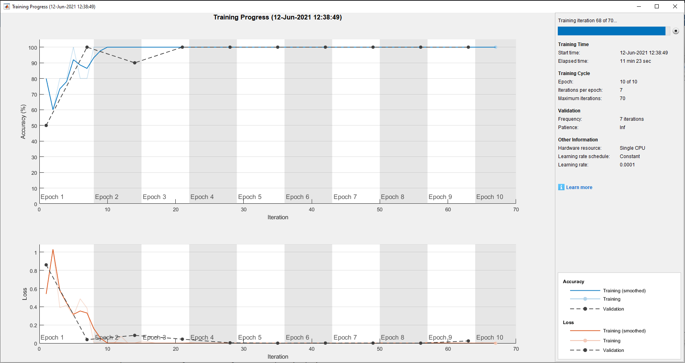

# Mammography-Breast-Cancer-Classification

## Data Source

Data Source 1 : [The mini-MIAS database of mammograms](http://peipa.essex.ac.uk/pix/mias/) !
Data Source 2 : [The Cancer Imaging Archive (TCIA)](https://www.cancerimagingarchive.net/nbia-search/) !

## Training

## Accuracy

### 89% for TCIA Dataset
### 60% for MIAS Dataset
